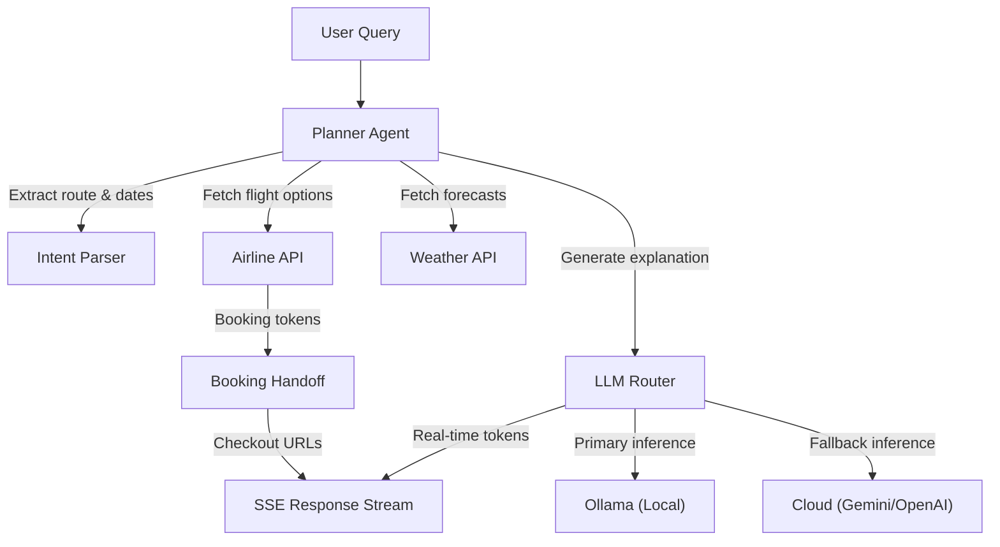

# llm-travel-agent — Portfolio Summary

## 1. What this is
A production-grade multi-agent travel planning system built to demonstrate robust LLM orchestration and real-time streaming interfaces. It processes natural language queries to search for flights and weather, utilizing enterprise patterns like circuit breakers, retry logic, and API key rotation to tolerate provider outages. What makes it non-trivial is its focus on resilient system design and deterministic fallback routing between local and cloud LLMs rather than simple prompt chaining.

## 2. Honest status
- **Core LLM Logic & Testing**: Heavily stubbed in automated tests; CI validation bypasses real LLM integration and async database behaviors, relying on mocked responses. (Evidence: `research/08-test-coverage-review.md:17` and `full_validation.py:3315`)
- **Booking Capability**: Stubbed/Partial. The system does not process payments; it only resolves SerpAPI booking tokens to generate replayable provider checkout URLs, which act as a handoff. (Evidence: `tools/booking_handoff.py:6-9`)
- **LLM Routing / Circuit Breaking**: Working. Complex fallback mechanics (Ollama → Gemini → OpenAI) and failure-tracking state machines are fully implemented. (Evidence: `agents/llm_router.py:123`, `core/circuit_breaker.py:169`)
- **Frontend Interface**: Working. A React 19 frontend utilizing Vite and Framer Motion handles SSE streaming responses in real-time. (Evidence: `frontend/package.json:15-16`)

## 3. Architecture
| Name | Role | Key Files |
| --- | --- | --- |
| Planner Agent | Monolithic state machine orchestrating tools and LLM steps | `agents/planner_agent.py` |
| Intent Parser | Regex-driven natural language extraction for dates/routes | `agents/intent_parser.py` |
| LLM Router | Priority-based routing across local/cloud providers | `agents/llm_router.py` |
| Airline API | SerpAPI integration to fetch and normalize Google Flights | `tools/airline_api.py` |
| Booking Handoff | Resolution and state tracking of provider checkout URLs | `tools/booking_handoff.py` |
| Weather API | OpenWeather integration for destination forecasts | `tools/weather_api.py` |
| RAG Retriever | Local embeddings retrieval from Markdown document corpus | `rag/retriever.py` |

## 4. Workflow graph (the important one)

## 5. Tech stack (proven)
- **FastAPI**: Backend REST and Server-Sent Events API (`requirements.txt:2`)
- **React 19**: Frontend UI framework (`frontend/package.json:16`)
- **Vite**: Frontend build tooling (`frontend/package.json:35`)
- **SQLAlchemy / PostgreSQL**: ORM and relational database configuration (`requirements.txt:8`, `docker-compose.yml:2`)
- **Prometheus / Grafana**: Observability and metrics stack (`docker-compose.yml:30`, `docker-compose.yml:48`)
- **Sentence-Transformers**: Local embeddings generator for RAG (`rag/retriever.py:2`)

## 6. True numbers
- `5` — Default circuit breaker failure threshold for providers — `core/circuit_breaker.py:49`
- `2802` — Lines of code in the atomic API key rotation manager — `core/api_key_manager.py:2802`
- `6908` — Lines of code in the monolithic planner agent — `agents/planner_agent.py:6908`
- `8.0` — Timeout in seconds for booking options HTTP requests — `tools/booking_handoff.py:40`
- `384` — Vector dimensions for local all-MiniLM-L6-v2 embeddings — `rag/retriever.py:19`
- `openhermes` — Configured default local Ollama model — `.env:37`
- UNVERIFIED: Time-to-first-token and actual API success rates (missing production traffic baselines).

## 7. Visual opportunities
- **System Architecture**: The Mermaid workflow graph from Section 4 demonstrates the failover and orchestration logic perfectly.
- **Frontend UI**: Running the React dev server (`cd frontend && npm run dev`) provides a highly visual SSE streaming interface with Framer Motion animations and a debug drawer for routing decisions.
- **Observability Dashboards**: Spinning up the monitoring profile (`docker-compose --profile monitoring up -d`) provides rich Grafana dashboards at `http://localhost:3000` to visualize circuit breaker states and API latency.

## 8. Redaction warnings
The following files contain sensitive API keys or database credentials that must be redacted before capturing any screenshots:
- `llm-travel-agent/.env:51-56` (SerpAPI keys)
- `llm-travel-agent/.env:57` (OpenAI key)
- `llm-travel-agent/.env:59-60` (Weather API keys)
- `llm-travel-agent/.env:61` (Database URL with password)
- `llm-travel-agent/.env:62-63` (Gemini API keys)

## 9. Coverage note
Directories skipped: `node_modules/`, `venv/`, `__pycache__/`, `.git/`, `.pytest_cache/`, and `.ruff_cache/`. These were omitted because they contain downloaded dependencies, compiled binaries, or temporary build/cache artifacts which are irrelevant to the core system's source code architecture.
