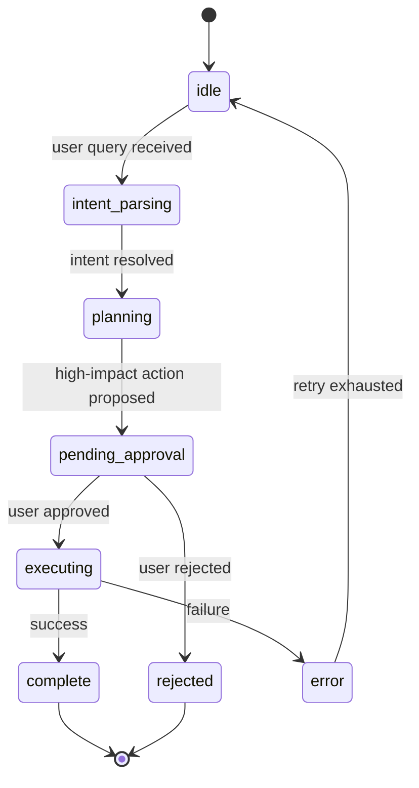

# Planner State Diagram

## Lifecycle

## State Descriptions

### idle
The planner awaits a user query. No active computation or external calls are in flight. Entry is the default state after initialization or after completion/rejection/error of a previous plan. In code, this is the state between calls to `plan_trip()` (`agents/planner_agent.py:5418`). Exit is triggered when a new user query arrives via `POST /ask`.

### intent_parsing
The user query is analyzed to extract origin/destination IATA codes, travel dates, cabin preferences, and other constraints. Implemented in `agents/planner_agent.py:3447` (`parse_intent()` and the intent resolution block in `_plan_trip_internal`). Transitions to `planning` once `intent.origin_iata` and `intent.destination_iata` are resolved (line 3588). Returns to `idle` on parse failure with an error response.

### planning
Flight search (`search_flights`, line 3961) and weather fetch (`get_forecast_for_date`, line 4045) are executed in parallel, results are scored and ranked (lines 4300-4560), and a prompt is assembled with RAG context injection (lines 2782-2800). If a booking handoff is required (`resolve_booking_handoff=True`), transitions to `pending_approval` (line 4577). Otherwise transitions directly to `executing` for LLM response generation.

### pending_approval
A HITL gate that blocks execution until the user explicitly approves or rejects the booking handoff. An `asyncio.Event` holds the planner while an SSE `approval_required` event is emitted to the frontend. Implemented at `agents/planner_agent.py:4580` (`_approval_store.request_approval()`). The API endpoint `POST /plan/{plan_id}/approve` (`api/app.py:2464`) sets the decision. On approval, `hitl_approved=True` (line 4590) and transitions to `executing`; on rejection, `hitl_approved=False` (line 4584) and transitions to `rejected`.

### rejected
The user declined the booking handoff. A rejection message is returned to the user and the planner returns to `idle`. The `booking_handoff_info` is set to `_deferred_booking_handoff_meta("hitl_approval_pending_or_rejected")` (line 4585). The plan terminates without executing any booking tool calls.

### executing
The LLM generates the final response (streaming or blocking). Flight data, weather, RAG context, and user preferences are included in the prompt assembled in `generate_explanation()` (`agents/planner_agent.py:2495`). The LLM call is made via `agents/llm_router.py:generate()`. On success, transitions to `complete`; on tool failure, backend timeout, or LLM error, transitions to `error`.

### error
An unrecoverable failure occurred during execution. The error is logged, metrics are recorded via `core/metrics.py`, and the planner returns to `idle` after retry logic is exhausted. Circuit breaker state is updated via `record_llm_failure()` (`agents/circuit_manager.py`). The error response includes a user-friendly message.

### complete
The response has been fully generated and delivered to the user. The planner returns to `idle`, ready for the next query. The result includes `best_flight`, `top_flights`, `all_flights`, and optionally `booking_handoff` metadata.

## Memory summarization contract

Session history is managed through `core/session_memory.py` (`SessionMemory`), a token-budgeted window with deterministic summarization. Each call to `plan_trip()` accepts an optional `session_id` parameter. When provided, the user query is recorded via `_session_memory.add_message(session_id, "user", user_query)` at entry (`agents/planner_agent.py:5536`). Before prompt assembly in `generate_explanation()`, session context is retrieved via `_session_memory.get_context(session_id)` and prepended to the LLM prompt after RAG context (`agents/planner_agent.py:2819-2824`).

The summarization strategy is deterministic: recent messages (last ~70% of history) are kept intact, while older messages are truncated proportionally to a configurable budget (`summary_ratio=0.3`, default). Sessions expire after `ttl_seconds=1800` (30 minutes) of inactivity and can be cleaned up via `cleanup_expired()`. Token counting uses a simple character-based estimate (`len(text) // 4`). No LLM calls are made for summarization, keeping latency predictable and cost-free.

Configuration via `SessionMemory(max_tokens=4000, summary_ratio=0.3, ttl_seconds=1800)`. The global singleton `_session_memory` is instantiated at module import in `agents/planner_agent.py:85`.
